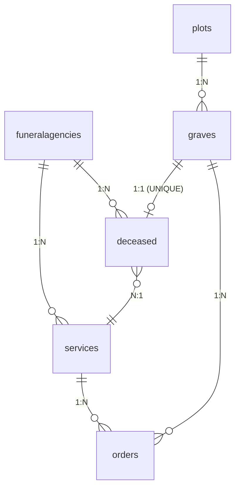

# Зеленоградское кладбище — проект по курсу "Базы данных"

Этот проект выполнен в рамках учебной дисциплины **"Базы данных"**. Он представляет собой разработку логической модели и реализацию базы данных, предназначенной для учета информации о кладбищах, могилах, умерших, услугах и связанных с ними объектах.

## 📌 Описание

Система предназначена для хранения и обработки информации, связанной с центральным кладбищем Зеленограда. В проекте реализована база данных, включающая в себя данные о участках, могилах, умерших, ритуальных агентствах, услугах и заказах.

## 🛠️ Используемые технологии

- PostgreSQL
- PL/pgSQL (для триггера)
- SQL 

## 🗃️ Структура базы данных

База данных состоит из следующих таблиц:

| Таблица          | Описание                                  |
|------------------|-------------------------------------------|
| `plots`          | Участки кладбища (Центральное, Северное)  |
| `graves`         | Могилы с географическими координатами     |
| `funeralagencies`| Ритуальные агентства                      |
| `deceased`       | Информация об умерших                     |
| `services`       | Услуги, предоставляемые на кладбище       |
| `orders`         | Заказы на услуги                          |



## ✅ Ограничения и валидация

- Все таблицы содержат ограничения `NOT NULL`, `CHECK`, `UNIQUE` и внешние ключи (`FOREIGN KEY`)
- Валидация телефонных номеров с помощью регулярных выражений
- Географические координаты проверяются на допустимые диапазоны
- Проверка логики дат: дата смерти не может быть раньше даты рождения

## 🔄 Бизнес-логика

### Триггеры

Реализован триггер `trg_set_grave_occupied`, который автоматически обновляет статус `is_occupied = true` у могилы при добавлении нового умершего (`deceased`), привязанного к ней.

```sql
create trigger trg_set_grave_occupied
after insert on deceased	
for each row
when (new.grave_id is not null)
execute procedure set_grave_occupied();
```
Также реализован триггер `add_burial_order`, который автоматически добавляет строку в таблицу `orders` при новом погибшем, выполняется услуга `Организация похорон`

```sql
CREATE OR REPLACE FUNCTION add_burial_order()
RETURNS TRIGGER AS $$
BEGIN
  INSERT INTO orders (service_id, grave_id, order_date, status)
  VALUES (NEW.burial_service_id, NEW.grave_id, NEW.date_dead, 'выполнено');

  RETURN NEW;
END;
$$ LANGUAGE plpgsql;

CREATE TRIGGER trg_add_burial_order
AFTER INSERT ON deceased
FOR EACH ROW
EXECUTE FUNCTION add_burial_order();
```
Также созданы индексы (файл add_index.sql) и процедуры (procedure.sql)

### 📋 Процедуры и их использование

1. Управление заказами

```sql
-- Удаление заказов по могиле
CALL delete_orders_by_grave(123);

-- Пример вызова с проверкой:
DO $$
BEGIN
  CALL delete_orders_by_grave(123);
  RAISE NOTICE 'Удалено заказов: %', (SELECT COUNT(*) FROM orders WHERE grave_id = 123);
END $$;
```

2. Аналитика

```sql
-- Генерация статистики по услугам
CALL generate_service_stats();

-- Просмотр результатов
SELECT * FROM service_stats ORDER BY order_count DESC;
```

3. Администрирование

```sql
-- Полная очистка БД (использовать с осторожностью!)
CALL clear_all_data();

-- Проверка очистки
SELECT COUNT(*) FROM deceased;  -- Должно вернуть 0
```

4. Автоматизация процессов

```sql
-- Создание заказа на захоронение
CALL create_burial_order(456);

-- Проверка созданного заказа
SELECT * FROM orders WHERE grave_id = (SELECT grave_id FROM deceased WHERE id = 456);
```
5. Освобождение могилы

```sql
CALL mark_grave_as_available(15);
```

# Использование:

- Для использования проекта выполните следующие действия (в pgAdmin4):

1. Запустите файл create_DB.sql
2. Запустите файл create_tables_and_triggers.sql
3. Добавьте индексы в проект запустив: add_index.sql
4. Запустите файл fill_DB.sql
5. Далее можно добавить процедуры запустив procedure.sql

- Через терминал:

1. Инициализация БД:
psql -f create_DB.sql

2. Создание структуры:
psql -f create_tables_and_triggers.sql

3. Оптимизация:
psql -f add_index.sql

4. Наполнение данными:
psql -f fill_DB.sql

5. Дополнительные процедуры:
psql -f procedure.sql

- С этого момента база данных создана и заполнена, примеры запросов можно посмотреть в файле:
query_example.sql

# Автор:

- Лядков Алексей
- GitHub: @mister-0-zero

# Доп.

## 📋 Структура таблиц

| Таблица             | Поля                                                                                                                   |
|--------------------------------------------------------------------------------------------------------------------------------------------- |
| **plots**           | `id (PK)`, `name`, `latitude`, `longitude`                                                                             |
| **graves**          | `id (PK)`, `plot_id (FK)`, `is_occupied`, `description`                                                                |
| **funeralagencies** | `id (PK)`, `name`, `phone`, `address`                                                                                  |
| **deceased**        | `id (PK)`, `full_name`, `date_birthday`,`date_dead`,`cause_of_death`,`grave_id (FK, UNIQUE)`, `funeralagency_id(FK)`|                    | `service_id (FK)`                                                                                                      |
| **services**        | `id (PK)`, `funeralagency_id (FK)` `name`, `price`                                                                     |
| **orders**          | `id (PK)`, `service_id (FK)`, `grave_id (FK)`, `order_date`,`status`                                                   |

## Ограничения и валидация

| Таблица             | Поле               | Тип ограничения         | Описание                                                              |
| ------------------- | ------------------ | ----------------------- | --------------------------------------------------------------------- |
| **plots**           | `name`             | `NOT NULL`              | Имя участка обязательно                                               |
|                     | `latitude`         | `NOT NULL`, `CHECK`     | Диапазон: от -90 до 90 и не пустое                                    |
|                     | `longitude`        | `NOT NULL`, `CHECK`     | Диапазон: от -180 до 180 и не пустое                                  |
| **graves**          | `plot_id`          | `FOREIGN KEY`           | Ссылка на `plots(id)`                                                 |
|                     | `is_occupied`      | `DEFAULT`               | Значение по умолчанию: `false`                                        |
| **funeralagencies** | `name`             | `UNIQUE`, `NOT NULL`    | Название агентства должно быть уникальным и не пустым                 |
|                     | `phone`            | `CHECK`                 | Регулярное выражение: `^\+?[0-9]{5,12}$`                              |
| **deceased**        | `full_name`        | `NOT NULL`              | Обязательное поле                                                     |
|                     | `date_dead`        | `CHECK`                 | Дата смерти должна быть после даты рождения                           |
|                     | `grave_id`         | `UNIQUE`, `FOREIGN KEY` | Ссылка на `graves(id)`, уникальность — одна могила на одного умершего |
|                     | `funeralagency_id` | `FOREIGN KEY`           | Ссылка на `funeralagencies(id)`                                       |
|                     | `service_id`       | `FOREIGN KEY`           | Ссылка на `service(id)`                                               |
| **services**        | `name`             | `NOT NULL`              | Обязательное название услуги                                          |
|                     | `funeralagency_id` | `FOREIGN KEY`           | Ссылка на `funeralagencies(id)`                                       |
|                     | `price`            | `NOT NULL`, `CHECK`     | Цена должна быть положительной                                        |
| **orders**          | `service_id`       | `FOREIGN KEY`           | Ссылка на `services(id)`                                              |
|                     | `grave_id`         | `FOREIGN KEY`           | Ссылка на `graves(id)`                                                |
|                     | `order_date`       | `DEFAULT`               | По умолчанию: `current_date`                                          |
|                     | `status`           | `NOT NULL`              | Статус заказа обязателен                                              |


Проект выполнен в учебных целях